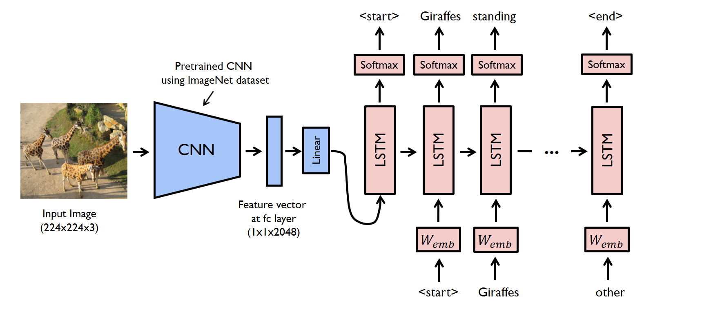

# STREAM (Semantic Text REgeneration and Alignment Module)

Đây là module tái tạo (regenerate) description từ ảnh đã được tạo ra từ mô hình. Sau đó căn chỉnh ngữ nghĩa sao cho phù hợp với văn bản ban đầu (given description).

Cấu trúc bao gồm 2 neural network:
- Encoder: mạng CNN dùng để trích suất đặc trưng hình ảnh (trong bài báo của qiaott sử dụng mạng [ResNet-152](https://arxiv.org/abs/1512.03385) đã được pretrained trên tập dữ liệu phân loại hình ảnh [ILSVRC-2012-CLS](http://www.image-net.org/challenges/LSVRC/2012/))
- Decoder: mạng RNN/LSTM dùng để tái tạo ngữ nghĩa từ đặc trưng hình ảnh đã được trích xuất.

Việc training module này sẽ được thực hiện trước khi training mô hình MirrorGAN. Điều này giúp mô hình MirrorGAN được hội tụ nhanh hơn và quá trình training cũng được ổn định hơn. Ngoài ra, việc training cả 2 module là không ổn định và tốn kém về mặt chi phí và bộ nhớ của máy.

Module STREAM do tác giả qiaott chia sẻ trong bài báo của mình được huấn luyện theo repo sau: [image_captioning by yunjey](https://github.com/yunjey/pytorch-tutorial/blob/master/tutorials/03-advanced/image_captioning/README.md)

## Giai đoạn đào tạo (Training phrase)

Với phần encoder, mô hình ResNet sẽ trích xuất feature vector từ một hinhg ảnh đầu vào xác định. Vector này được biến đổi tuyến tính để có cùng kích thước đầu vào với mạng LSTM.

Với phần decoder, văn bản nguồn (source description) và đích (target description) sẽ được xác định trước. Ví dụ với câu "Giraffes standing next to each other" thì văn bản nguồn là 1 vector với nội dung ['<start>', 'Hươu cao cổ', 'đứng', 'tiếp theo', 'đến', 'mỗi' , 'other'] và văn bản đích là ['Hươu cao cổ', 'đứng', 'tiếp theo', 'đến', 'mỗi', 'khác', '<end>']. Sử dụng các chuỗi nguồn và đích này cũng như vectơ đặc trưng, ​​bộ giải mã LSTM được đào tạo như một mô hình ngôn ngữ dựa trên vectơ đặc trưng.

## Giai đoạn thử nghiệm (Test phrase)

Trong giai đoạn thử nghiệm, encoder gần giống với giai đoạn đào tạo. Nhưng có một điểm khác biệt là lớp batchnorm layer sử dụng trung bình cộng (average) và phương sai (variance) thay cho mini-batch statistics.

Đối với decoder, có sự khác biệt đáng kể giữa hai giai đoạn. Trong giai đoạn thử nghiệm, bộ giải mã LSTM không thể nhìn thấy mô tả hình ảnh. Để giải quyết vấn đề này, LSTM sẽ phản hồi từ được tạo trước đó cho đầu vào tiếp theo. Điều này có thể được thực hiện bằng cách sử dụng vòng lặp for.